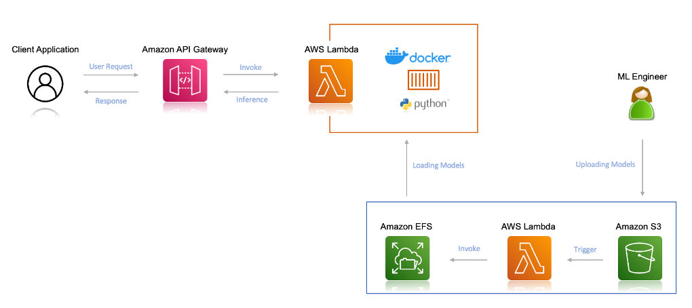
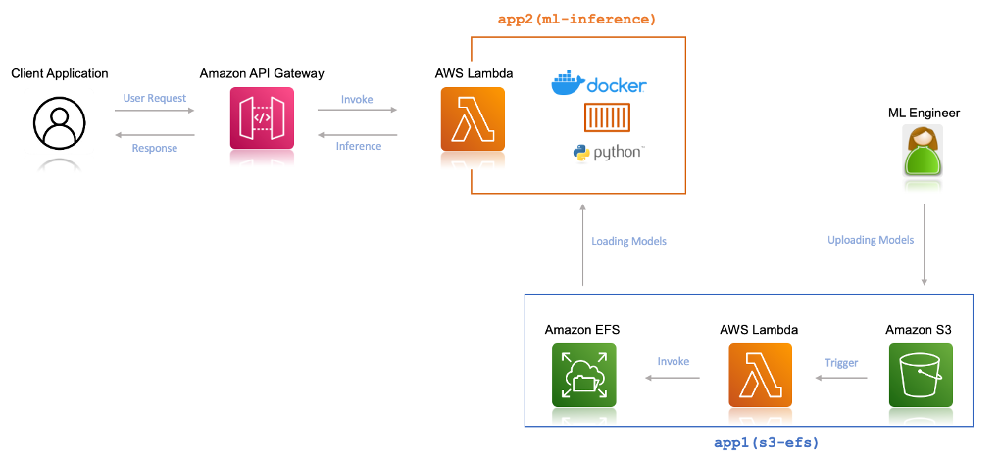

# Machine Learning Inference using AWS Lambda and Amazon EFS
Repository for Deploying multiple machine learning models for inference on AWS Lambda and Amazon EFS

## Introduction 

In this repo, you will find all the code needed to deploy your application for Machine Learning Inference using AWS Lambda and Amazon EFS. 

## Application Workflow 

Here is the architectural work flow of our application:

- Create a serverless application which will __trigger__ a Lambda function upon a new model upload in your `S3 bucket`. And the function would copy that file from your S3 bucket to `EFS File System`

- Create another Lambda function that will load the model from `Amazon EFS` and performs the __prediction__ based on an image.

- Build and deploy both the application using  `AWS Serverless Application Model (AWS SAM)` application.

# Architecture 

To use the Amazon EFS file system from Lambda, you need the following:

- An Amazon __Virtual Private Cloud (Amazon VPC)__
- An __Amazon EFS__ file system created within that VPC with an access point as an application entry point for your __Lambda function__.
- A __Lambda function__ (in the same VPC and private subnets) referencing the access point.

The following diagram illustrates the solution architecture:

# Create an Amazon EFS file system, access point, and Lambda function

Now, we are going to use a single SAM deployment to deploy this, which will create the following two serverless applications, let’s call it :

- __app1(s3-efs)__: The serverless application which will transfer the uploaded ML models from your S3 bucket to the your EFS file system
- __app2(ml-inference)__: The serverless application which will perform the ML Inference from the client. 

